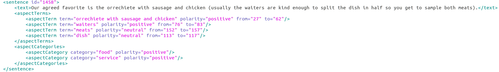
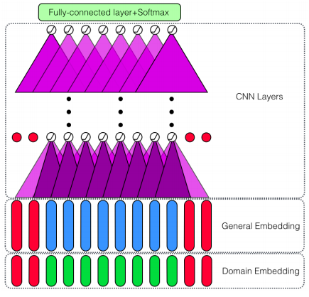
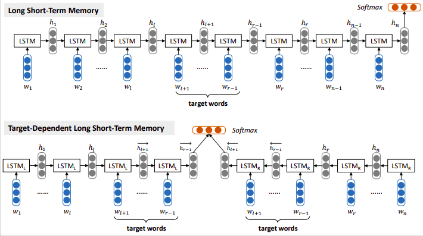

# Deep Learning Approaches to Aspect Based Sentiment Analysis

[Project Report](DeepLearning_ABSA.pdf )
## Introduction
Sentiment analysis or opinion mining is a text analysis method to detect polarity (e.g. a positive or negative opinion) within the text. Sentiment analysis has been called a "suitcase research problem", as it contains a suitcase of other NLP challenges (atleast 15) which need to addressed separately as subtasks of the problem. Although in most research, it is primarily treated as a simple classification task which can't effectively tackle the basic premise of sentiment analysis i.e. the idea of conveying emotions and opinions through natural language. The text can be analyzed at various levels i.e. document level to examine the overall polarity of the document and the sentence level in which the document is broken down into individual sentences. Much of the current approaches limit their focus to these two levels i.e. detecting the overall polarity of the text. 

However, in unstructured product reviews, people tend to express multiple opinions about various features of the product. Depending upon their likes and dislikes some of the opinions expressed about specific features may be positive and some may be negative. Here the text is examined at the third level i.e. the aspect level where the polarity of the specific domain-related entities (e.g., laptops, restaurants) and their aspects/attributes (e.g., battery, screen; food, service) are analyzed.  Such an approach, is formally called **Aspect Based Sentiment Analysis (ABSA)**, wherein a document is assumed to be composed of a range of opinion units targeted towards multiple entities in the text. Entity here could be tangible referring to a product, a person, an organization , etc. or could be intangible referring to a topic, say service in a restaurant. These entities could be further made up of components which in itself have a set of associated attributes.

Initially, most of the approaches to ABSA relied on hand-crafted rules based on linguistic techniques such as dependency parsing and POS tagging. More recently, deep learning approaches are being used more and more. This forms the basic premise of our project, where we focus on the tasks of extracting the aspect terms (**ST1**) and then detecting the polarity associated with the term (**ST2**). We achieve this through adapting deep learning architectures based on Convolutional Neural Networks and Long Short Term Memory networks from the literature on our task. 

## Data
We use the SemEval 2014 dataset consisting of user reviews on the restaurant domain. The dataset contains over 3000 English sentences each along with annotations for aspect terms (Subtask 1), aspect term polarity (Subtask 2), aspect categories (Subtask 3) and aspect-category specific polarity (Subtask 4). The dataset is adapted from Ganu et al. 2009 , which only provided annotations for the aspect category. The sentences in the datasets are annotated using XML tags as follows:

## Aspect Extraction (Subtask1)
### Problem Statement 
*Given  a  set  of  sentences  with  pre-identified  entities  (e.g.,  restaurants),  identify  the  aspect terms present in the sentence and return a list containing all the distinct aspect terms.*

For example:
“I liked the service and the staff, but not the food”→{service, staff, food}

Here, we pose the aspect extraction problem as a sequence labelling task, where for eachword in a sentence, our task is to classify it into three categories using the Begin-Inside-Out labelling scheme; {B,I,O}.  B indicates beginning of the word, I indicates the continuingword (in case of multi-word aspect) and O indicates the non-aspect words.

### System Description
We implement the deep learning architecture presented in Xu et al.’s (2018) paperDoubleEmbeddings  and  CNN-based  Sequence  Labeling  for  Aspect  Extraction[19].  The aspect ex-traction system uses 300-dimensional Word2vec general embeddings concatenated with 100-dimensional domain-specific embeddings (restaurant and laptop) to obtain a 400-dimensionalword vector representation.  The deep learning system consists of four convolution layers followed by a fully connected dense layer which outputs softmax probabilities 

## Aspect Polarity Detection (Subtask 2)
### Problem Statement 
*For  a  given  set  of  aspect  terms  within  a  sentence,  determine  whether  the  polarity  of  eachaspect term is positive (1), negative (-1) or neutral (0).*

For example:
“I loved their fajitas“→ {fajitas:positive}
“I hated their fajitas, but their salads were great“→ {fajitas:negative,salads:positive}
“The fajitas are their first plate“→ {fajitas:neutral}

### System Description
We implement the deep learning architecture presented in Xu et al.’s (2018) paper *Double Embeddings and CNN-based Sequence Labeling for Aspect Extraction*. The aspect extraction system uses 300-dimensional Word2vec general embeddings concatenated with 100-dimensional domain-specific embeddings (restaurant and laptop) to obtain a 400-dimensionalword vector representation.  The deep learning system consists of four convolution layers followed by a fully connected dense layer which outputs softmax probabilities 

